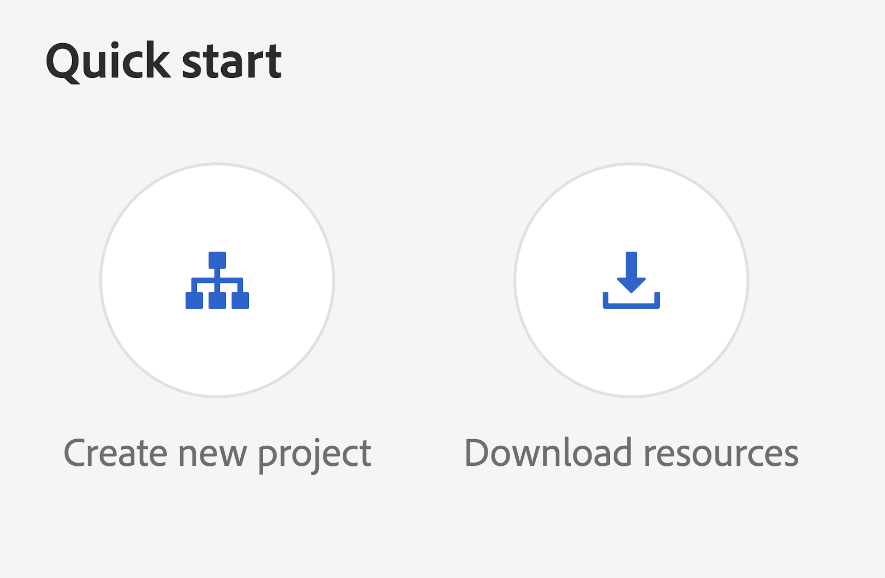
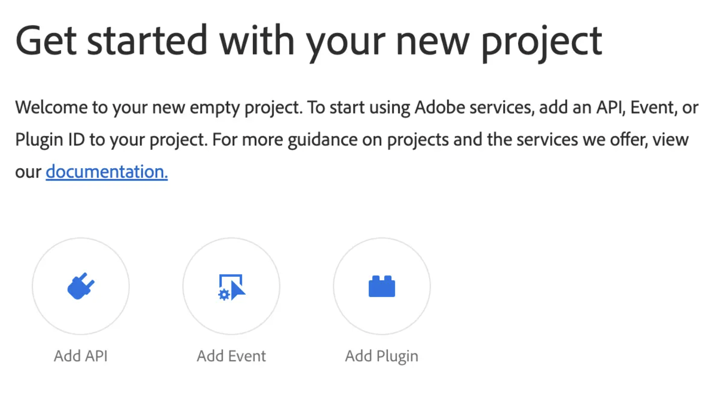
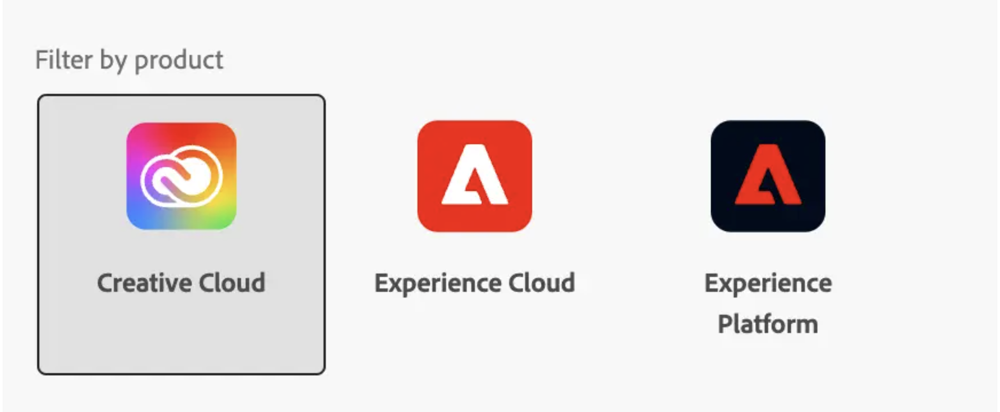
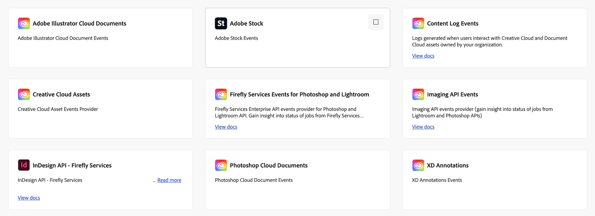
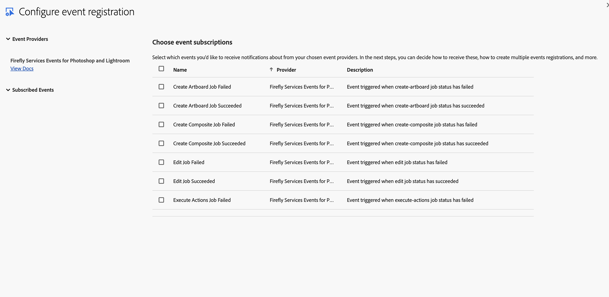
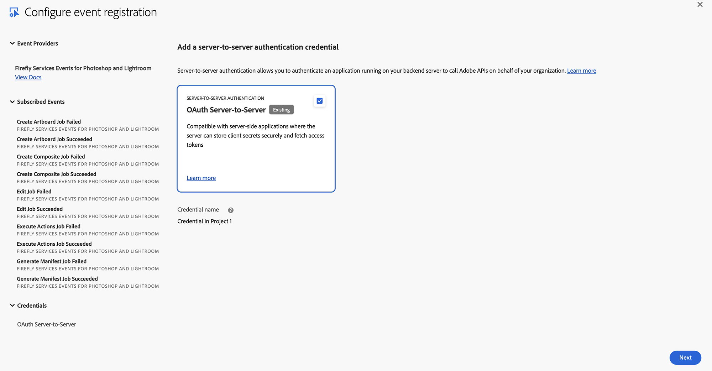
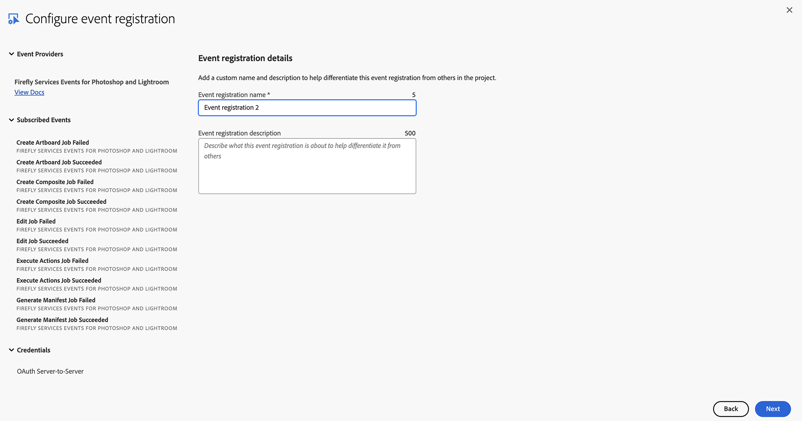
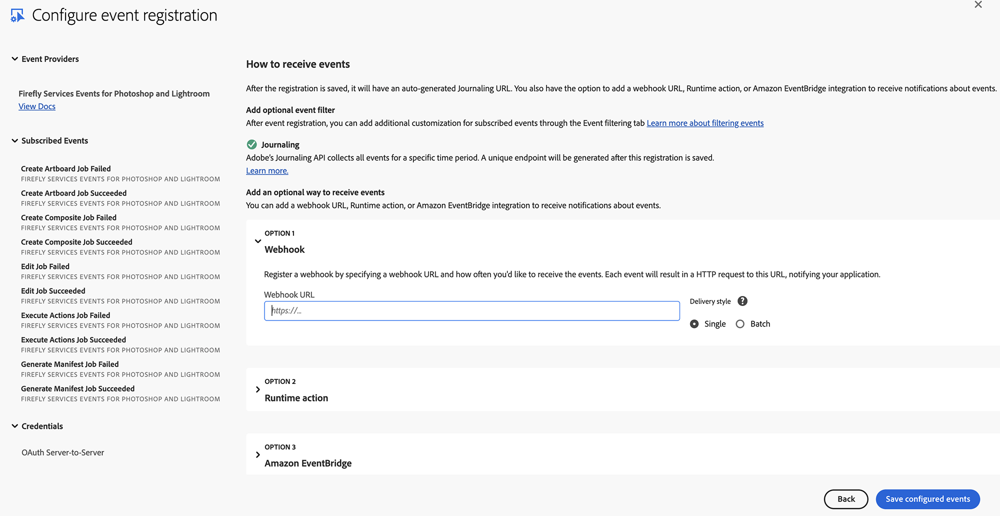
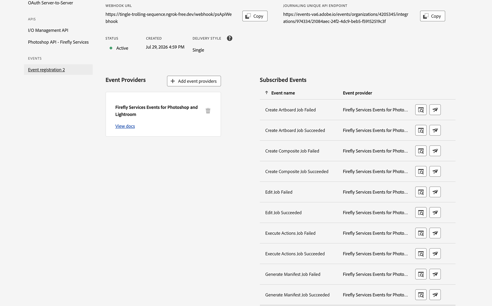

# Setting up Firefly Services Events for Photoshop and Lightroom with Adobe I/O Events

These instructions describe how to set up and get started using Adobe I/O Events for Firefly Services for Photoshop and Lightroom job processing events. You can use Adobe I/O for streaming Firefly Services job processing events such as job creation, processing, completion, and failure status updates.

## Introduction

Firefly Services events provide comprehensive job processing details, similar to those shown in the status calls of Firefly Services APIs. However, Firefly Services events are more comprehensive and real-time, unlike the status calls which only include basic status information.

Firefly Services events provide detailed information about:

* **Job Lifecycle Events** - Complete job processing workflow from creation to completion
* **Success Events** - Detailed success information including job outputs and results
* **Failure Events** - Comprehensive error details and failure reasons
* **Real-time Updates** - Immediate event notifications as jobs progress

## Setup Adobe I/O

See [Getting Started with Adobe I/O Events](https://developer.adobe.com/events/docs/guides/)

For basic instructions for this use case, starting from developer.adobe.com/console:

_When prompted, click the designated button to proceed_:

* Select `Create new project`


* Select `Add event`


* Filter by `Creative Cloud` Filter Selection


* Select `Select Firefly Services Events for Photoshop and Lightroom`


* Subscribe to the job processing events of your choosing


* Set up OAuth Server-to-Server Credentials.
   * The OAuth Server-to-Server credential relies on the OAuth 2.0 client_credentials grant type to generate access tokens.


* Set up Event Registration
   * Provide a name and description for this event subscription


* Configure Event Registration


   * Optionally choose whether to enable Webhook or Runtime action
   * **Enable Webhook**
     * We recommend batch over single webhooks
     * For `Webhook URL` a public https endpoint must be provided
     * The endpoint must be able to handle get and post requests
     * The get request must respond with the challenge query if it exists
     * The post request must respond that it received the message or the webhook will re-attempt to send several times before giving up and automatically disabling the webhook sends
   * **Enable Runtime action**
     * See [Setting up your Runtime Environment](https://developer.adobe.com/events/docs/guides/runtime-webhooks/)
     * Select a pre-made runtime action/runtime namespace
   * After Saving
   
   
   * **Verify setup**
     * Verify that the Status is `Active`
     * If Webhook was selected, verify that it successfully passed the challenge without errors

### Event Data Structure

Events are structured in JSON format using the CloudEvents spec

_Example Event (Success)_:

```json
{
  "specversion": "1.0",
  "type": "com.adobe.photoshop-api.v2.generate-manifest.success",
  "source": "urn:aio_provider_metadata:cc_ffs_ps_job_status",
  "id": "7e3a89ce-d1f5-4b55-a9fc-682e3ac535e2",
  "time": "2025-01-20T10:40:00Z",
  "datacontenttype": "application/json",
  "requestorclientid": "cis_services",
  "adobeinternal": {
    "imsOrg": "36E3670466D07CD10A49422F@AdobeOrg"
  },
  "data": {
    "jobId": "ad746e92-8991-69h3-ce4c-eg15e45d5h7h",
    "status": "succeeded",
    "createdTime": "2025-01-20T10:35:00Z",
    "modifiedTime": "2025-01-20T10:40:00Z"
  }
}
```

_Example Event (Error)_:

```json
{
  "specversion": "1.0",
  "type": "com.adobe.photoshop-api.v2.create-composite.failed",
  "source": "urn:aio_provider_metadata:cc_ffs_ps_job_status",
  "id": "70b8efcb-38f2-4781-84ee-036013d3f5bc",
  "time": "2025-01-20T10:35:00Z",
  "datacontenttype": "application/json",
  "requestorclientid": "cis_services",
  "adobeinternal": {
    "imsOrg": "36E3670466D07CD10A49422F@AdobeOrg"
  },
  "data": {
    "jobId": "9c635d81-7880-58g2-bd3b-df04d34c4g6g",
    "status": "failed",
    "createdTime": "2025-01-20T10:30:00Z",
    "modifiedTime": "2025-01-20T10:35:00Z",
    "errorDetails": [
      {
        "error_code": "failed",
        "message": "Failed to process the composite image"
      }
    ]
  }
}
```

_Data Field Definitions:_

| Field | Description |
|-------|-------------|
| `specversion` | CloudEvents specification version (always "1.0") |
| `type` | Type of event used for event subscription routing |
| `source` | Context in which an event happened |
| `id` | Unique UUID generated per event |
| `time` | Timestamp of the completion of the action |
| `datacontenttype` | Content type of the data payload (always "application/json") |
| `requestorclientid` | Client ID of the requestor (always "cis_services") |
| `adobeinternal` | Adobe-specific extensions containing IMS organization information |
| `data` | Event data object containing job information |
| `data.jobId` | ID of the JOB |
| `data.status` | Job status ("succeeded" or "failed") |
| `data.createdTime` | Time stamp in ISO 8601 format when job was created |
| `data.modifiedTime` | Time stamp in ISO 8601 format when job was last modified |
| `data.result` | Job result containing outputs (optional for generate-manifest) |
| `data.result.outputs` | List of job outputs as raw objects |
| `data.errorDetails` | List of error details (only present for failed jobs) |

### Event List

_Note - This is a snapshot listing of all available events for Firefly Services for Photoshop and Lightroom._

| Event Type | Description |
|------------|-------------|
| `com.adobe.photoshop-api.v2.create-artboard.success` | Artboard creation job completed successfully |
| `com.adobe.photoshop-api.v2.create-artboard.failed` | Artboard creation job failed |
| `com.adobe.photoshop-api.v2.create-composite.success` | Composite image creation job completed successfully |
| `com.adobe.photoshop-api.v2.create-composite.failed` | Composite image creation job failed |
| `com.adobe.photoshop-api.v2.generate-manifest.success` | Manifest generation job completed successfully |
| `com.adobe.photoshop-api.v2.generate-manifest.failed` | Manifest generation job failed |
| `com.adobe.photoshop-api.v2.edit.success` | Edit job completed successfully |
| `com.adobe.photoshop-api.v2.edit.failed` | Edit job failed |
| `com.adobe.photoshop-api.v2.execute-actions.success` | Execute actions job completed successfully |
| `com.adobe.photoshop-api.v2.execute-actions.failed` | Execute actions job failed |

## Event Filtering

You can filter events based on:

1. **Event Type**: Subscribe to specific event types (e.g., only success events)
2. **Job ID**: Filter by specific job identifiers
3. **Status**: Filter by job status (succeeded/failed)
4. **Request Type**: Filter by operation type (create-artboard, create-composite, generate-manifest, edit, execute-actions)

## Error Handling

### Common Error Scenarios

1. **Network Issues**: Implement retry logic with exponential backoff
2. **Message Processing Failures**: Use dead letter queues for failed messages
3. **Schema Validation Errors**: Log and skip malformed messages
4. **Consumer Lag**: Monitor consumer lag and scale consumers as needed

## Troubleshooting

### Webhook Issues
  - Verify webhook URL is publicly accessible
  - Check Adobe I/O Console event registration status
  - Ensure webhook endpoint returns 200 OK
  - Check webhook signature verification
  - Verify event types are correctly selected
  
## Support and Resources

- **Adobe I/O Events Documentation**: [https://developer.adobe.com/events/docs/guides/](https://developer.adobe.com/events/docs/guides/)
- **Firefly Services Documentation**: [https://developer.adobe.com/firefly-services/docs/photoshop/](https://developer.adobe.com/firefly-services/docs/photoshop/)
- **CloudEvents Specification**: [https://cloudevents.io/](https://cloudevents.io/)
- **Kafka Documentation**: [https://kafka.apache.org/documentation/](https://kafka.apache.org/documentation/)

## Contact

For technical support or questions about Firefly Services Events for Photoshop and Lightroom, please contact the Adobe Developer Support team.

---

**Last Updated**: July 2026
**Version**: 1.0
**Provider**: Firefly Services Events for Photoshop and Lightroom

