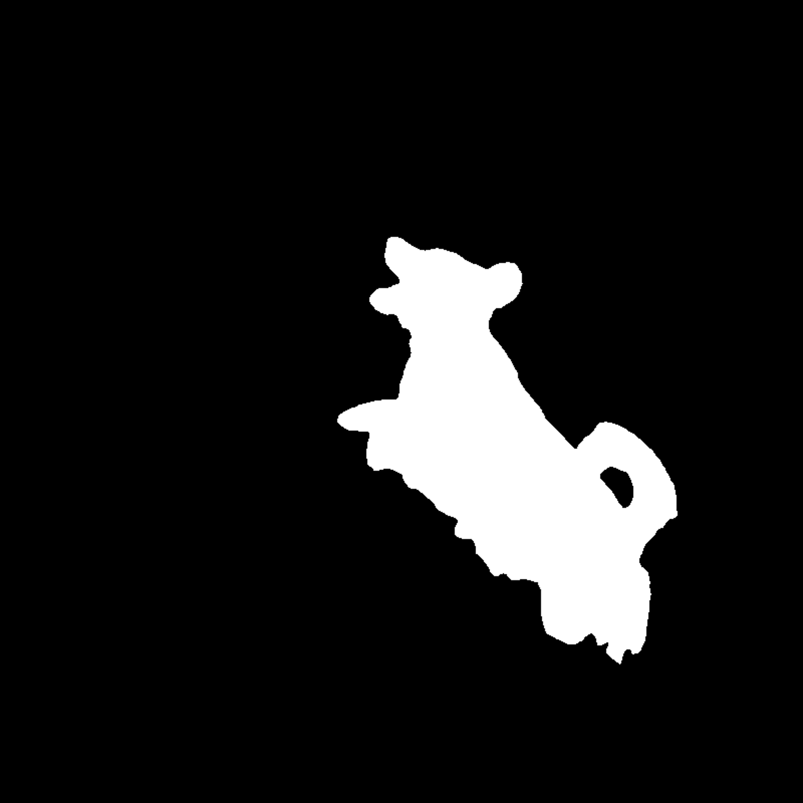

# Inpainting with Fill Mask

Learn how to use the Fill Masked Areas API in your code workflows by performing the image inpainting task in this guide.

## Overview

This guide uses the Fill Masked Areas API to perform an image inpainting task.

Image inpainting is one of the fundamental tasks in computer vision and has many practical applications, such as object removal and manipulation, image re-targeting, image compositing, and 3D effects.

The API accepts an input image and an input mask indicating the hole(s) on the image and returns an image with the hole(s) filled.

## About the Fill Masked Areas API

Before getting into the code, let's consider conceptually how the Fill Masked Areas API works at a high level.

- You begin with a source image, which can be used with one of the supported cloud storage providers.
- You then provide a *masked* version of the image. That mask will be where the Photoshop API will add generated content.

Now, let's start the exercise.

## Prerequisites

-  Valid credentials. If you don't have them yet, first visit the Firefly Services [Getting Started](../index.md) guide to obtain a `client_id` and `client_secret`.
-  Node.js installed on your machine and basic familiarity with `JavaScript`.
-  Store the source and mask images below in a supported cloud storage provider.

### Source image


### Mask image



## Calling the Fill Masked Areas API

Use the [v1/mask-objects](../../api/index.md) endpoint first to generate masks to provide in your requests to this endpoint.

A simple example of the request body required to use the API is below:

```json
{
  "image": {
    "source": {
      "url": "<source_image_url>"
    }
  },
  "masks": [
    {
      "source": {
        "url": "<mask_image_url>"
      }
    }
  ]
}
```

The source of the images, take pre-signed URLs from the cloud storage provider.

<InlineAlert variant="info" slots="header, text" />

NOTE

The Photoshop API has a `mask-objects` endpoint that can be used to create masks for an operation like inpainting.

## Generated result

You can see in the image below that by masking the dog, and then filling that masked area, the API has generated a new image with the dog removed.


## Complete sample code

If it's helpful to see a complete implementation, we've provide the full JavaScript code sample.

<Accordion>

<AccordionItem header="Full code sample" isChevronIcon  position="right" iconColor="#1473E6">

```js
const axios = require("axios");

// Ensure ACCESS_TOKEN environment variable is there with the correct value of access token
const { ACCESS_TOKEN } = process.env;

// REST API's status codes
const STATUS_ACCEPTED = 202;
const DEFAULT_SERVICE_BASE_URL = "https://ff-services-api-stage.adobe.io";

// object containing api endpoints
const apiEndpoints = {
  FILL_MASKED_AREAS: "/v1/fill-masked-areas",
};

/**
 * Function to make get api call
 * @param {string} url - Api end point
 * @param {object} headers - headers to be passed
 * @returns {Promise} - Response of the API call
 */
function makeGetCall(url, headers) {
  return axios.get(url, { headers });
}

/**
 * Function to make post api call
 * @param {string} url - Api end point
 * @param {object} payload - Payload to be passed
 * @param {object} headers - Headers to be passed
 * @returns {Promise} - Response of the API call
 */
function makePostCall(url, payload, headers) {
  return axios.post(url, payload, { headers });
}

/**
 * Function to make service api calls
 *  - post api call to get the status url
 *  - get api call to get the result
 * @param {string} url - Api end point
 * @param {object} payload - Payload to be passed
 * @param {object} headers - Headers to be passed
 * @returns {Promise} - Object of image urls and its properties
 */
async function makeServiceApiCall(url, payload, headers) {
  const postResponse = await makePostCall(url, payload, headers);
  if (postResponse.status === STATUS_ACCEPTED) {
    const statusUrl = postResponse.data.statusUrl;
    const getResult = await makeGetCall(statusUrl, headers);
    return getResult.data;
  } else {
    console.log("Error in serviceApiCall post operation ", postResponse);
  }
}

/**
 * Function to fill masked areas of image based on the masks provided
 * @param {object} payload - payload with image and masks
 * @param {object} headers - headers to be passed
 * @returns {Promise} - result of the api response
 */
async function fillMaskedArea(headers, serviceBaseUrl, payload) {
  const endpoint = new URL(
    apiEndpoints.FILL_MASKED_AREAS,
    serviceBaseUrl
  ).toString();
  return makeServiceApiCall(endpoint, payload, headers);
}

/**
 * Function to fetch token
 * @returns {Promise} - token string
 */
async function fetchAccessToken() {
  return `Bearer ${ACCESS_TOKEN}`;
}

/**
 * Function to generate headers
 * @returns {Promise} - headers object
 */
async function generateHeaders() {
  const token = await fetchAccessToken();
  const headers = {
    "Content-Type": "application/json",
    // Update X-Api-Key with the actual api key
    "X-Api-Key": "<your_api_key>",
    Authorization: token,
  };
  return headers;
}

async function main() {
  // update serviceBaseUrl
  const serviceBaseUrl = "<your_service_base_url>" || DEFAULT_SERVICE_BASE_URL;
  // update sourceImageUrl with the source image url
  const sourceImageUrl = "<your_source_image_url>";
  // update maskUrlArray with the mask urls
  const maskUrlArray = ["<your_mask_url>"];
  const headers = await generateHeaders();

  const payload = {
    image: {
      source: {
        url: sourceImageUrl
      }
    },
    masks: maskUrlArray.map((mask) => ({
      source: {
        url: mask
      }
    }))
  };
  const result = await fillMaskedArea(headers, serviceBaseUrl, payload);
  const finalImage = result.image.destination.url;
  return finalImage;
}

main();
```

</AccordionItem>

</Accordion>
